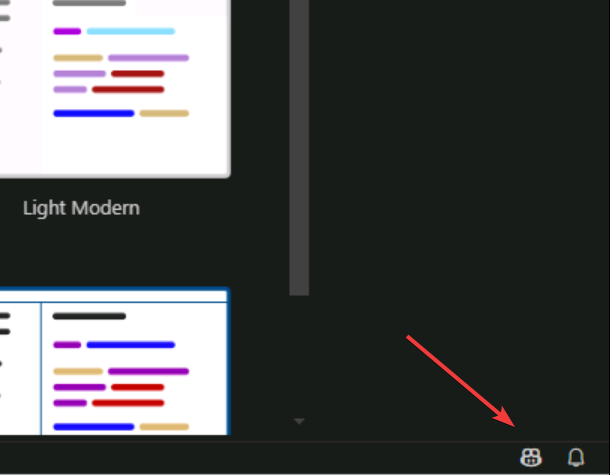
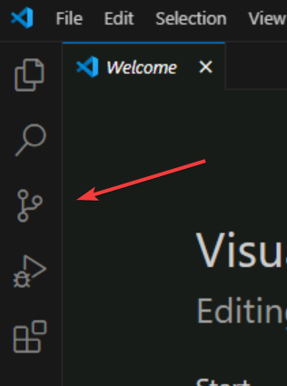

# Workshop setup

To complete this workshop you will need to clone a repository with a copy of the contents of this repository

> [!Hint]
> Under regular conditions you would need to ensure all prequirements, but don't worry. We have ensured this environment as all you need.

## Configure GitHub Copilot

> [!IMPORTANT]
> For this lab you need a [GitHub account](https://docs.github.com/en/get-started/learning-about-github/types-of-github-accounts), if you don't have one no worries, you can create a personal account for free. Create your account in the [GitHub sign up page](https://github.com/signup).

TODO: warn users NOT to use EMU accounts?

1. [] Create a GitHub Account if you don't already have one
2. [] Open Visual Studio Code
3. [] Click on Copilot icon on VS Code status bar (top bottom right)



4. [] Click on **Set up Copilot** blue button
5. [] Click on **Sign In** blue button in modal window that opened
6. [] Enter your login and password (and MFA if asked to) on the browser that was automatically opened
7. [] Click **open**  browser asks for the confirmation (**This site is trying to open Visual Studio Code.**)
8. [] After Copilot is setup you should now have a **Walktrhoug: GitHub Copilot Chat** open tab in Visual Studio Code

## Clone lab repository

Let's clone the repository you'll use for your workshop.

1. [] Open Visual Studio Code
2. [] Click on the Source Control icon on the left sidebar



3. [] Click on **Clone Repository** button
4. [] Type `https://github.com/github-samples/pets-workshop`   TODO: fix URL
5. [] Select the repository destination folder (suggestion: use the suggested one)
    - Note: The repository will be cloned to **<selected folder>/pets-workshop**
6. [] Click **Open** button when asked if you **Would like to open the cloned repository?**
7. [] Click the `Yes, I trust the authors" button when asked.

The code is now opened in Visual Studio, feel free to take a look at it or skip to the next section to start the app.

## Start the app

1. [] Click on **...** on the menu bar at the top and then select **Terminal -> New Terminal**
2. [] Start the application by running the following command on the terminal:

    ```pwsh
    .\scripts\start-app.ps1
    ```

The startup script will install all dependencies and start two applications:

- The backend Flask app on **http://localhost:5100**. You can see a list of dogs by opening the the url `http://localhost:5100/api/dogs`
- The frontend Astro/Svelte app on **http://localhost:4321**. You can see the by opening that URL.

Try it now, open a browser and navigate to the links provided above.

## Configuring Copilot

## Summary and next steps

You've now cloned the repository you'll use for this workshop and have your IDE setup! Next let's **add a new endpoint to the server**

[astro-url]: http://localhost:4321
[dogs-api]: http://localhost:5100/api/dogs
[flask-url]: http://localhost:5100
[fork-repo]: https://docs.github.com/en/get-started/quickstart/fork-a-repo
[required-resources]: ./README.md#required-resources
[required-software]: ./README.md#required-local-installation
[template-repo]: https://docs.github.com/en/repositories/creating-and-managing-repositories/creating-a-template-repository
[website-url]: http://localhost:4321